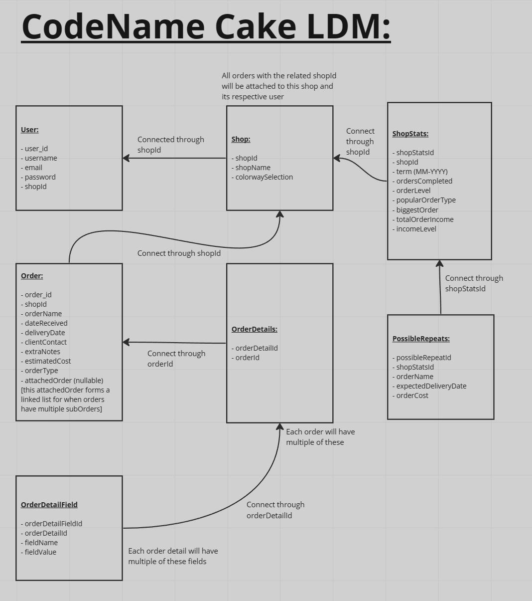

# CodeName-Cake

Order Management System mobile application hosted through a react native front end on Expo App, with all of the code logic and collected data residing at a SpringBoot application and PostGreSQL database hosted through Railway

&nbsp;
&nbsp;
&nbsp;

# Key Features:

- User Authentication and Authorization.
- User and respective Shop profile.
- Order Management based on dates and type of order.
- Dynamic order display when close to their due dates.
- Automatic PDF receipt generation for each order.
- Personalized order creation tools made specifically for cake and other baked goods orders.
- Stat tracking for orders to keep the user informed on their progress.

&nbsp;
&nbsp;
&nbsp;

# Instructions on accessing the application:

- Download the Expo App on your mobile device.
- Scan the QR code to be posted below with your phone's camera (or the Expo App's QR scanner). This should add the application to your list of 'projects', letting you constantly access it without having to scan the QR code again:
  
- Create an account following the instructions on the app or login with your credentials if you already have an account.
- Manage your shop!

&nbsp;
&nbsp;
&nbsp;

# TechStack:

- This application is obviously divided into its front end and its back end. Part of the reason behind me doing this application is to practice my skills in the frameworks I've chosen as I am completely new to them. If it was for my own comfort I would just use Django and React and whip up a website in no time, but that wasn't the idea.
- On the front end side, I've kept it simple and decided to make use of React Native as my framework of choice, and Expo as my development and deployment environment.
- For the back end, I've gone with Spring Boot and PostGreSQL as my framework-database combination, and Railway as my hosting service.
- Docker was used for my back-end during development but is to be abandoned upon deployment.

&nbsp;
&nbsp;
&nbsp;

# Architecture:

- Package by feature type of architecture for the back end, grouping classes based on the entity they are associated with.

## Logical Data Model:

- The LDM for the application is the following:
  

&nbsp;
&nbsp;
&nbsp;

# Intended Users:

- The target audience for this application is honestly my mom… and I guess other bakers that sell their products locally. It is a very niche thing, but sometimes your tipical applications for this type of tracking like notion might be too broad for this specific area that I’m trying to cover, and something like an Excel sheet might be too complex in terms of inputting data while also being too simplistic and not intuitive at all.

- The real purpose is for this application to perfectly fit the needs of these shop owners when it comes to making receipts and keeping track of their orders, while also getting the bonus of keeping track of their stats and being able to see how they can better optimize their business practices based on them.

&nbsp;
&nbsp;
&nbsp;

# User Stories:

- As a user I want to be able to open the application and get setup as a user with the username and shop name I enter on the welcome screen, or login into my existing account.

- As a user I want to be able to create a new order for my shop (think of McDonalds registers, you don’t want the user managing them, you want the shop owner or a delegated individual to manage this system to record orders). This order should have its own order id, date received (auto filled by app), date to deliver, order details, cost, order_contact (contact information string that can be an email, IG username, phone, …) and extra notes.

- As a user I want to be able to create order details for an order. Order details can be one of the following, which each include the listed sub-details that can either be filled out or left blank:

  - Cake:
    - tiers: list of tuples of the format <tier level (1 is the bottom) - tier cake flavor - tier filling flavor - tier covering (fondant or buttercream) - tier covering flavor>. For this we just offer an ‘add new tier’ button to append new tiers to the existing list.
    - decorations: list of tuples of the format <items - number of items - desctiption of items (all strings)>. For this we just offer an ‘add new decoration’ button to append new decorations to the existing list.
  - Cookies:
    - batches: list of tuples of the format <cookie type - # of cookies - flavor - filling - decoration description>. For this we just offer an ‘add new batch’ button to append new cookie batches to the existing list.
  - Cupcakes:
    - batches: list of tuples of the format <cupcake type - # of cupcakes- flavor - filling - frosting - decoration description>. For this we just offer an ‘add new batch’ button to append new cupcake batches to the existing list.
  - Other:
    - type: specifies whether this is a batch type item like a cookie or solo item like a cake
    - if batch type item, create list of tuples of the format <baking good type - description> where the description can be a long string (text box like) detailing each of the details that we have on the default options and more.
    - if solo type item, just create a description text box for all details to be explained there.

- As far as storing this, receipts are automatically made for each order, containning all of the details and sent to our database. If a detail is not specified or skipped, ‘null’ is put in its place (e.g. if tier covering for a cake is fondant, tier covering flavor is included in the receipt but set to ‘null’).

- As a user I want to be able to modify an order object, including the order details associated with it.

- As a user I want be able to see the orders I set up appear in my personal calendar. You can click on this calendar or on the order queue page to access an order to edit or delete.

- As a user I want to be able to get a wrap of my stats throughout the year (such as orders per month, order type, money made, …).

&nbsp;
&nbsp;
&nbsp;

# Possible Extensions:

- ~~Central Database (maybe this is the project that I make with SpringBoot) that keeps track of user accounts (so this is basically the online-ization of the application), and given the receipts for a user every once in a while, we collect some of the stats such as orders, order types, popular items, popular times of the year, … and we analyze them in order to provide the shop owner to know when and what they should try to optimize for given their client base~~. [Already being Implemented]

- Rigurous testing of the application. At the moment I am not testing the application at all apart from just playing around with it and making sure the basic functionalities work and/or letting my 'test users' (my mom) play around with it and see if they find any bugs. So setting up unit tests for the application would be a good idea for the future when I have more time and want to make significant changes to the application.

- Order migration endpoint that allows for users to get their orders as a CSV/txt file. I already implemented the PDF receipt system, but I would like, especially during the first couple deployments of this application where changes/resets to the database might still be fairly common, to allow for users to get their orders as a CSV/txt file so that they can keep track of them themselves in the case that I need to reset the system.

- Given enough users make use of the application, we could allow for a marketplace type extension to the application where users can directly place orders into shops and have them be accepted or not (we would not deal with the money transfers though).

- Generate a link to a website displaying the order status for users to share with their clients.

&nbsp;
&nbsp;
&nbsp;

# Important Notes:

Note, all of the files in this project have been fully developed by me, Michele Massa, if you are interested in talking to me about coding, why I did something the way I did, or want to use a file, please ask for permission by shooting an email at: michelemassa802@gmail.com. It takes no effort and is a little nicer than just stealing the code. 

All of the files under this project are copyrighted under copyright (c) 2022 Michele Massa. So please, ask for permission if you want to use my files.

Aside from copying files, I am also not going to be open to collaboration in the project since it's more of a solo development thing that I really wanted to experience, if you have any recommendations as far as making it better however, or want to hire me to code something for you, once again shoot me an email at: michelemassa802@gmail.com.
